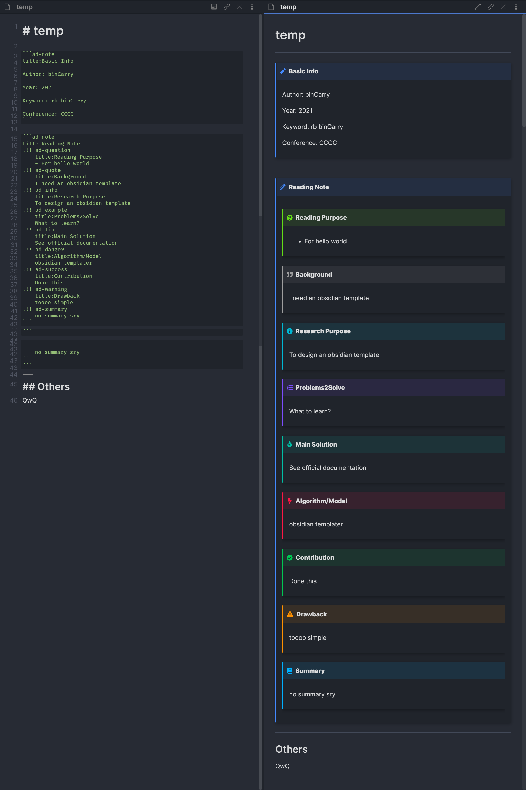

# Obsidian-Templater-Templates
&emsp;This repo is used to store all the templates I design for various situation like essay reading,diary,academic report and so on.

**FOR A BETTER CODE VIEW, SEE THE RAW CODE BUT NOT MARKDOWN STYLE**

## Templates until now
> Attention: All the template files with '-admonition' mean you need to use this template with obsidian plugin `admonition` to show its origin appearance.
### Essay Reading
